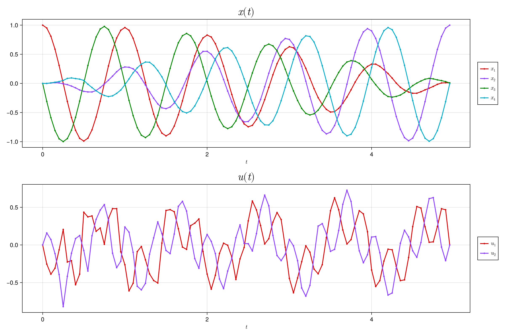

# TrajectoryBundles.jl

[](https://github.com/aarontrowbridge/TrajectoryBundles.jl/actions/workflows/CI.yml?query=branch%4Amain)

## Description

The *[trajectory bundle method](https://kevintracy.info/ktracy_phd_robotics_2024.pdf#page=155)* is a sample-based, gradient-free, parallelizable optimization algorithm for solving trajectory optimization problems of the form

$$
\begin{align*}
\underset{x, u}{\text{minimize}} \quad & Q \left\lVert r_N(x_N)\right\rVert^2 + \sum_{k=1}^{N-1} R \left\lVert r_k(x_k, u_k)\right\rVert^2 \\
\text{subject to} \quad & x_{k+1} = f(x_k, u_k, \Delta t, t_k) \\
& c_k(x_k, u_k) \geq 0 \\
& x_1 = x_{\text{init}} \\
\end{align*}
$$

where $f(x, u, \Delta t, t)$ is an abuse-of-notaton denoting the solution to an ODE, $\dot{x} = f(x, u, t)$, over the time interval $[t, t + \Delta t]$. 


<!-- TrajectoryBundles.jl is a Julia package that provides a high-level interface for defining, solving, and visualizing trajectory optimization problems using the trajectory bundle method. -->

**TrajectoryBundles.jl** uses
 - [NamedTrajectories.jl](https://github.com/kestrelquantum/NamedTrajectories.jl) to define, manipulate, and plot trajectories
 - [OrdinaryDiffEq.jl](https://github.com/SciML/OrdinaryDiffEq.jl), [DiffEqGPU.jl](https://github.com/SciML/DiffEqGPU.jl), and [CUDA.jl](https://github.com/JuliaGPU/CUDA.jl) to solve the underlying ODEs
 - [Convex.jl](https://github.com/jump-dev/Convex.jl) and [Clarabel.jl](https://github.com/oxfordcontrol/Clarabel.jl) for solving the underlying quadratic program

## Installation

To install TrajectoryBundles.jl, enter package mode in the Julia REPL:

```
$ julia --project
```

and run the following command:

```julia
julia> ]
pkg> add https://github.com/aarontrowbridge/TrajectoryBundles.jl.git 
```

## Usage

:construction: Interface is changing rapidly :construction:

See the example script [examples/bilinear_dynamis.jl](./examples/bilinear_dynamics.jl) for a the most up-to-date usage.

For solving a simple bilinear optimal conrol problem, driving a state $x_0 = (1 \ 0 \ 0 \ 0)$ to a goal state $x_1 = (0 \ 1 \ 0 \ 0)$, under the dynamics given by

$$
\dot{x} = G(u(t), t) x
$$

setting up a problem with TrajectoryBundles.jl looks like this:

### System setup 

```julia
using LinearAlgebra
using SparseArrays
using NamedTrajectories
using TrajectoryBundles
using CUDA

# construct dynamical generators: elements of real isomorphism of the Lie algebra 𝔰𝔲(2)

Gx = sparse([
     0  0 0 1;
     0  0 1 0;
     0 -1 0 0;
    -1  0 0 0
])

Gy = sparse([
    0 -1 0  0;
    1  0 0  0;
    0  0 0 -1;
    0  0 1  0
])

Gz = sparse([
     0 0 1  0;
     0 0 0 -1;
    -1 0 0  0;
     0 1 0  0
])

# drift and control generators
G_drift = Gz
G_drives = [Gx, Gy]

# drift frequency
ω = 1.0e0 * 2π

# carrier waves
carrier = t -> [cos(ω * t), sin(ω * t)]

# generator for bilinear dynamics: ẋ = G(u(t), t) x
G(u, t) = ω * Gz + sum((u .* carrier(t)) .* G_drives)

# GPU compatible kernel function
f! = build_kernel_function((dx, x, u, t) -> mul!(dx, G(u, t), x), 4, 2)

# initial and goal states
x_init = [1.0, 0.0, 0.0, 0.0]
x_goal = [0.0, 1.0, 0.0, 0.0]

# number of time steps
N = 100

# time step
Δt = 0.05

# control bounds
u_bound = 1.0

# initial control sequence
u_initial = u_bound * (2rand(2, N) .- 1)

# initial control trajectory, via rollout with initial control sequence
x_initial = rollout(x_init, u_initial, f, Δt, N)

# construct initial trajectory
traj = NamedTrajectory((
        x = x_initial,
        u = u_initial
    );
    controls = (:u,),
    timestep = Δt,
    bounds = (
        u = u_bound,
    ),
    initial = (
        x = x_init,
        u = zeros(2)
    ),
    final = (
        u = zeros(2),
    ),
    goal = (
        x = x_goal,
    )
)

# plot initial trajectory
NamedTrajectories.plot(traj)
```


### Problem setup

```julia
# goal loss weight
Q = 1.0e3

# control regularization weight
R = 1.0e-1

# terminal loss residual
r_loss = x -> √Q * (x - traj.goal.x)

# control regularization residual
r_reg = (x, u) -> √R * u

# control bounds residual
c_bound = (x, u) -> [u - traj.bounds.u[1]; traj.bounds.u[2] - u]

# initial and final state constraints
c_initial = (x, u) -> [
    x - traj.initial.x;
    traj.initial.x - x;
    u - traj.initial.u;
    traj.initial.u - u;
]

c_final = (x, u) -> [
    u - traj.final.u;
    traj.final.u - u
]

# assemble costs and constraints
rs = Funcion[fill(r_reg, N-1)...]
cs = Function[c_initial; fill(c_bound, N-2); c_final]

# define σ scheduler
# number of bundle samples at each knot point
M = 2 * (traj.dim) + 1

# construct bundle problem
prob = TrajectoryBundleProblem(traj, f, r_loss, rs, cs;
    # σ_scheduler = (args...) -> exponential_decay(args...; γ=0.9)
    σ_scheduler = cosine_annealing
    # σ_scheduler = linear_scheduler
)

# solve bundle problem
TrajectoryBundles.solve!(prob;
    max_iter = 200,
    σ₀ = 1.0e0,
    gpu = true,
    gpu_backend = CUDA.CUDABackend()
)

# plot best trajectory 
NamedTrajectories.plot(prob.best_traj)
```


### Objective value


### :warning: Note :warning:
Due to stochasticity of algorithm, results may vary.